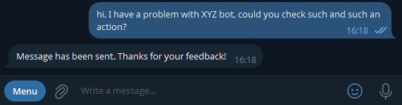
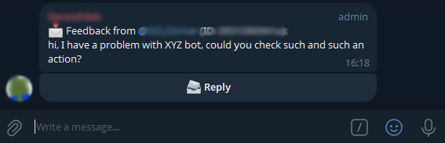
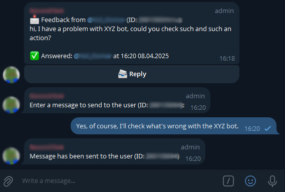
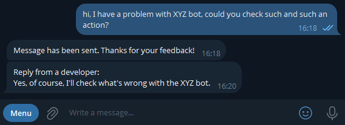

# Feedback Bot / Бот для обратной связи


## Содержание / Contents

1. [Версия программы / Program version](#версия-программы--program-version)
2. [Введение / Introduction](#введение--introduction)
3. [Функционал / Functionality](#функционал--functionality)
4. [Пример использования / Usage example](#пример-использования--usage-example)
5. [Установка и запуск / Installation and running](#установка-и-запуск--installation-and-running)
6. [Запуск через Docker / Docker Deployment](#запуск-через-docker--docker-deployment)
7. [Кастомизация / Customization](#кастомизация--customization)
8. [Список команд / List of supported commands](#список-команд--list-of-supported-commands)
9. [Версии / Versions](#версии--versions)
10. [Лицензия / License](#лицензия--license)

## Версия программы / Program version

### 1.3.0

## Введение / Introduction

Телеграм бот для получения обратной связи. Может быть настроен на пересылку сообщений в группу или
конкретному пользователю. Поддерживает несколько языков (русский, английский).

Telegram bot for collecting feedback. It Can be configured to forward messages to a group or
specific user. Supports multiple languages (Russian, English).

## Функционал / Functionality

- Получение обратной связи от пользователей
- Форматирование текста, добавление дополнительной информации об отправителе (юзернейм, ID,
  локализация)
- Пересылка дополненных сообщений от пользователей в группу администраторов или конкретному
  пользователю (который принимает фидбек)
- Доставка ответа на обратную связь пользователю
- При настройке работы с группой администраторов, бот будет ожидать в течение 2 минут ответ того
  администратора, который нажал кнопку "Ответить", остальные сообщения от других администраторов
  будут игнорироваться.
- Бот поддерживает несколько языков (русский, английский), язык устанавливается в зависимости от
  локализации пользователя, который оставляет обратную связь.

---

- Collecting user feedback
- Text formatting with sender info (username, ID, locale)
- Forwarding messages to an admin group or specific recipient
- Delivering responses back to users
- For group mode: 2-minute timeout for selected admin to respond
- Russian and English language support (auto-detected by user locale)

## Пример использования / Usage example

- **Отправка обратной связи / Sending feedback**: Пользователь отправляет обратную связь, бот
  пересылает сообщение в указанный чат. / User sends feedback, the bot forwards the message to the
  defined chat.

  

- **Получение обратной связи / Getting feedback**: Сообщение доставляется в указанный чат. / The
  message is delivered to the defined chat.

  

- **Процесс ответа на сообщение пользователя / The process of responding to a user's message**:

  

- **Получение ответа на обратную связь / Getting a response to feedback**: Пользователь получает
  ответ на свою обратную связь. / User gets a response to their feedback.

  

## Установка и запуск / Installation and running

### Системные требования / System requirements

- Java 21 (или выше / or higher)
- Gradle 8.10 (опционально / optional)

### Инструкция по установке / Installation guide

1. Клонируйте репозиторий / Clone repository:
    ```bash
    git clone https://github.com/ath31st/telegram_feedback_bot
    ```
2. Перейдите в директорию / Go to directory:
    ```bash
    cd telegram_feedback_bot
    ```
3. Проверьте версию Java 21+ / Verify Java 21+:
    ```bash
    java -version
    ```

4. Запустите скрипт для сборки проекта / Run build script:

   для windows / for windows:
   ```bash
   gradlew.bat build
    ```
   для linux / for linux:
   ```bash
   ./gradlew build
    ```

Этот скрипт скачает Gradle автоматически и создаст JAR-файл со всеми зависимостями.

This will download Gradle automatically and create a standalone JAR file with all dependencies
included (fat JAR).

### Инструкция по запуску / How to run

1. Найдите сгенерированный JAR-файл в папке build/libs/feedback_bot-x.x.x-standalone.jar или
   скачайте его [отсюда](https://github.com/ath31st/telegram_feedback_bot/releases) / Locate
   the generated JAR file in build/libs/feedback_bot-x.x.x-standalone.jar or download it
   [here](https://github.com/ath31st/telegram_feedback_bot/releases)
2. Запустите JAR-файл / Run the JAR file:

   для linux / for linux:
    ```bash
   export TELEGRAM_BOT_TOKEN="your-bot-token-here"
   export FEEDBACK_CHAT_ID="your-chat-id-here"
   java -jar build/libs/feedback_bot-x.x.x-standalone.jar
    ```
   для windows / for windows:
    ```bash
   set TELEGRAM_BOT_TOKEN="your-bot-token-here"
   set FEEDBACK_CHAT_ID="your-chat-id-here"
   java -jar build\libs\feedback_bot-x.x.x-standalone.jar
    ```

Будьте внимательны, что вам нужно определить версию приложения вместо x.x.x
В FEEDBACK_CHAT_ID вам надо указать ID вашего чата(группы) с администраторами или ID конкретного
пользователя, который будет принимать фидбек.

Beware that you need to define an application version instead of x.x.x
In FEEDBACK_CHAT_ID you need to specify the ID of your chat(group) with administrators or the ID of
a specific user who will accept feedback.

## Запуск через Docker / Docker Deployment

Далее все команды указаны для Linux / Next commands are for Linux

1. Verify Docker installation / Проверка установки Docker

    ```bash
    docker --version
    ```
2. Быстрый старт / Quick start:

    ```bash
    docker run -d \
    -e TELEGRAM_BOT_TOKEN="insert-your-telegram-bot-token-here" \
    -e FEEDBACK_CHAT_ID="insert-your-feedback-chat-id-here" \
    --name feedback-bot \
    ath31st/telegram-feedback-bot:latest
    ```
3. Полный старт / Full start:

   a) Создание конфигурационного файла / Create config file
    ```bash
    echo "TELEGRAM_BOT_TOKEN=insert-your-telegram-bot-token-here
    FEEDBACK_CHAT_ID=insert-your-feedback-chat-id-here" > feedback.env
   ```
   b) Запуск контейнера / Run container
    ```bash
   docker run -d \
    --env-file feedback.env \
    --restart unless-stopped \
    --name feedback-bot \
    ath31st/telegram-feedback-bot:latest
    ```

## Кастомизация / Customization

Вы можете изменить текст сообщений в `src/main/resources/messages_*.properties`

You can modify text messages in `src/main/resources/messages_*.properties`

## Список команд / List of supported commands:

    /start
    /settings
    /help

## Версии / Versions:

- Kotlin: 2.1.20
- TelegramBotAPI: 25.0.1
- Gradle: 8.10

## Лицензия / License

This project is distributed under the terms of the MIT license. See [LICENSE](LICENSE).